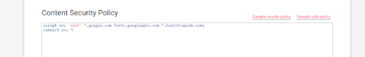

# BYPASS CSP SCRIPT-SRC CON GOOGLE

Las políticas de seguridad de contenido, o csp, son una protección extra para evitar ataques, que comúnmente son los XSS, entre otros. Para saber si un sitio cuenta con CSP, podemos simplemente hacer una request y capturarla, y al ver la respuesta, podríamos ver un header de tipo "Content-Security-Policy" o usando este sitio, que nos dirá que tipo de protecciones tiene. En este caso nos vamos a centrar en la política "SCRIPT-SRC". Esta protección básicamente se resume de esta manera. Cualquier sitio que este en la lista blanca podrá ejecutar ese código, de lo contrario, no ejecutará nada.

### EJEMPLO:

En la foto se aprecia que todo el codigo que venga de `*.google.com  fonts.googleapis.com *.bootstrap.com` se podrá ejecutar, lo cual es un grave error, ya que si alguno de esos sitios cuenta con algún JSONP, se podrá bypassear nuestra política.

En este caso, si quisiéramos ejecutar un xss en una web que tenga esa política, usaríamos un JSONP que venga de bootstrap o de google.com, ya que están en la lista blanca.

### PRUEBA DE CONCEPTO
Como vimos anteriormente, cualquier codigo que venga de esos 2 sitios será ejecutado en nuestro sitio. Google cuenta con un JSONP, y con ello, podriamos bypassear esa protección.

`https://accounts.google.com/o/oauth2/revoke?callback=`

Ese es nuestro JSONP, y un ejemplo de uso sería este:

``

En ese ejemplo, enviamos las cookies a nuestro cliente burp con un bypass de csp script-src.
