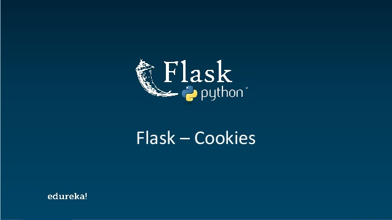

# COOKIES CON FLASK
 
En este nuevo artículo, les hablaré sobre las cookies con flask y su funcionamiento en aplicaciones web.

Primero veamos para qué sirve una cookie. Una cookie sirve para recordar acceso, conocer si un usuario ya ha visitado la página anteriormente y actuar en consecuencia, como por ejemplo, mostrar contenido.

Entonces, como podemos ver, una cookie puede servir incluso para loguearnos a un sitio sin siquiera escribir credenciales ya que recordó que anteriormente nos habíamos registrado.





Ya que sabemos lo que es una cookie, ahora nos queda preguntarnos, ¿Qué es Flask? en palabras cortas, Flask es un framework que permite crear apps web de manera muy sencilla (en python). Ahora, al momento de crear una cookie con Flask, es necesario crear una llave privada para cifrar nuestras cookies y que de esa manera nadie pueda generar alguna cookie sin nuestra llave. Flask cuenta con una variable llamada "SECRET_KEY" que nos permite generar la llave privada para cifrar las cookies, un ejemplo sería:


```app.config['SECRET_KEY'] = 'Aqui_nuestra_llave'```


En un CTF, lo único que nos interesa es eso, encontrar la llave privada, ya que con ella nosotros podemos generar nuestras propias cookies.
Te estarás preguntando ¿y cómo encuentro esa llave privada? pues existen varios payloads para encontrar la llave privada, pero los más comunes son estos:


* {{url_for.__globals__}} 
* {{url_for.__globals__.os.__dict__}} 
* {{request.url[23:]}} 
* {{config}}


Puedes encontrar más payloads [aquí](https://github.com/swisskyrepo/PayloadsAllTheThings/tree/master/Server%20Side%20Template%20Injection#basic-injection). Una vez que ya sabemos que payload puede funcionar para encontrar nuestra llave privada, solamente queda intentar probarlo en algún input que haya disponible.


En el ejemplo de arriba, se puede apreciar la llave secreta, y ya con eso simplemente buscamos un script que pueda generar una cookies y vualá, tendríamos el poder de generar cuantas cookies quieras.


Contacto: [Linkedin](https://www.linkedin.com/in/jairr/) [Twitter](https://twitter.com/_niggurath_)
