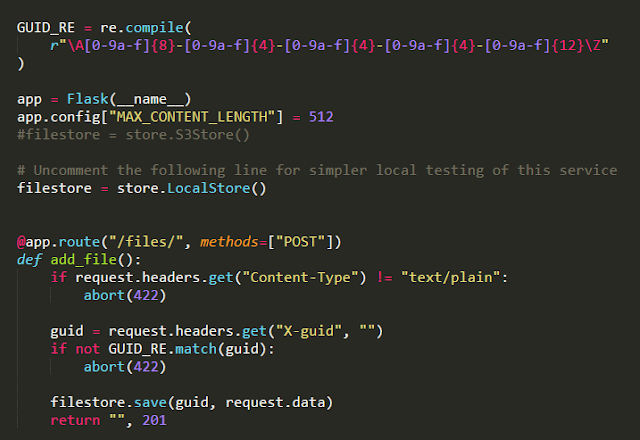
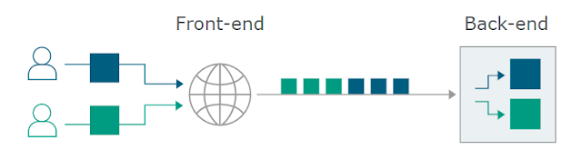
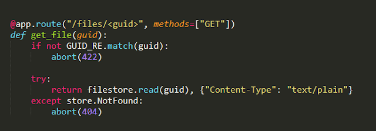

# HTTP REQUEST SMUGGLING (ESPAÑOL)

Este reto de la categoría web se resolvió durante la participación en el CTF de Defcon hace unas semanas.

## Challenge

Uploooadit, el reto nos da 2 archivos escritos en Flask. [Store.py](https://drive.google.com/file/d/1Z_vWaLantTPysMckqwYrHkg1X6TzK8tb/view?usp=sharing) y [app.py](https://drive.google.com/file/d/1yMgQwd9WVGNqVnu9_UkV-0C2c5T4kXjh/view?usp=sharing)

Al analizar los archivos, no se puede ver alguna vulnerabilidad en el código pero hay algo importante dentro del archivo app.py.

Para que una petición sea válida debe cumplir con lo siguiente:

* Guid con un patrón en específico, un ejemplo válido sería algo como esto:
`aaaaaaaa-aaaa-aaaa-aaaa-aaaaaaaaaaaa`

* El valor de la cabecera Content-Type tiene que contener:
`text/plain`

Una vez que hacemos una petición a /files/  de la manera correcta observamos varias cosas interesantes.

El servidor HTTP es un Gunicorn en la versión 20.0.0 y se utiliza un proxy (HAProxy), si hacemos una simple búsqueda de vulnerabilidades encontramos que esa versión es vulnerable a ataques HTTP Desync Request smuggling

Normalmente una petición y una respuesta funcionarían como en la imagen anterior, dos clientes envían peticiones al servidor backend, el servidor las procesa y les regresa su response a ambos clientes, pero en un ataque HTTP Desync Request Smuggling es diferente, veamos.

Como puede verse ahora, dos clientes (uno de ellos nosotros los atacantes) hacen un request pero el atacante envía información ambigua, que nuestro servidor backend interpretaría como dos peticiones, de modo que parte de la petición del otro usuario quedaría incrustada en su petición.
Ahora veamos qué sucede si al momento de enviar una solicitud válida, justamente como dice en la imagen 1,  mandamos a llamar a nuestro archivo anteriormente creado con el guid 

Como podemos observar, si mandamos a llamar nuestro archivo con el guid proporcionado podemos acceder a lo que hemos guardado, como se menciona en el archivo app.py

Ahora que tenemos todo eso en mente, repasemos qué es lo que tenemos. Pero primero veamos este diagrama del funcionamiento de HAProxy, Gunicorn y nuestra aplicación escrita en Flask.

Puesto todo eso en la mesa nos damos la idea de que debemos probar el ataque de solicitudes entre HAProxy y Gunicorn, pero eso no tendría sentido a menos que  exista un bot que esté mandando la flag. Algo que nos fue de mucha ayuda fue reconocer cuál era el vector, gracias a portswigger, ya que tras varios intentos no reconocíamos cuál de todas las vulnerabilidades era la indicada, y dimos al final con CL-TE. (Content-Length(CL) y Transfer-Encoding(TE))

De esa manera todo fue más transparente ya que podíamos contrabandear una solicitud que posiblemente sea nuestra flag (algún bot actuando como un usuario mandando la bandera).

La siguiente imagen explica como funciona el HTTP REQUEST SMUGGLING CL.TE

A continuación, como suponíamos que un bot estuviera enviando nuestra flag cada cierto tiempo (actuando como un usuario), podríamos romper su request sin procesar por el backend y hacer que su petición se guarde en nuestro archivo.
(su request contendría el 'body' completo, que en este caso suponíamos que sería nuestra flag, para después mandar a llamar el archivo creado con el guid /FILES/GUID para poder visualizarla).

  Y BINGO, la request sin procesar se guardó en nuestro archivo
  
  * Referencias: 
    * [HAproxy request smuggling](https://nathandavison.com/blog/haproxy-http-request-smuggling)
    * [http-desync-attacks-request-smuggling](https://portswigger.net/research/http-desync-attacks-request-smuggling-reborn)

